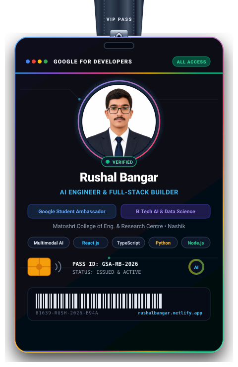
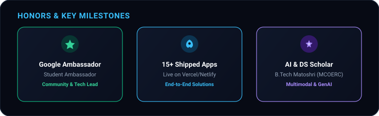
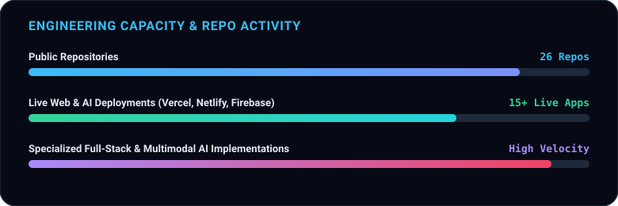
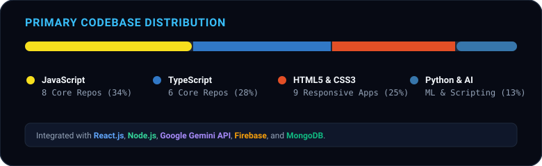

  <picture>
    <source media="(prefers-color-scheme: dark)" srcset="banner.svg">
    <source media="(prefers-color-scheme: light)" srcset="banner-light.svg">
    
  </picture>

   
   

  
  
  
  

   

  
  
  
  

---

### 👨‍💻 Executive Summary

<table>
  <tr>
    <td width="64%" valign="middle">
      
<strong>AI Engineer &amp; Full-Stack Developer</strong> passionate about architecting end-to-end intelligent systems, multimodal interfaces, and user-centric web platforms.

      <ul>
        <li>🎓 <strong>Academic Background:</strong> B.Tech scholar in <strong>Artificial Intelligence &amp; Data Science</strong> at Matoshri College of Engineering &amp; Research Centre (MCOERC).</li>
        <li>🌟 <strong>Leadership &amp; Advocacy:</strong> Serving as a <strong>Google Student Ambassador</strong>, championing AI awareness, developer workshops, and modern tech stacks.</li>
        <li>🚀 <strong>Proven Velocity:</strong> Designed, architected, and shipped <strong>15+ production-ready web platforms and AI-driven solutions</strong>.</li>
        <li>💡 <strong>Core Expertise:</strong> Multimodal AI integration (Gemini, Claude, OpenAI), Full-Stack JavaScript/TypeScript, Real-Time Cloud Infrastructure, and Scalable UX.</li>
        <li>📍 <strong>Location:</strong> Nashik, Maharashtra, India.</li>
      </ul>
    </td>
    <td width="36%" align="center" valign="middle">
      
    </td>
  </tr>
</table>

---

### 🏆 Honors & Key Milestones

  

---

### 🚀 Featured Production Projects

#### 🤖 Flagship AI & Intelligent Systems

| Project | Live Demo | Architecture & Tech Stack | Engineering Impact |
| :--- | :---: | :---: | :--- |
| **[VivaVox](https://github.com/RushalBangar/VivaVox)** | [**Live App** ↗](https://vivavox19.netlify.app/) | `TypeScript` `React` `Multimodal AI` `Tailwind` | **AI-Powered Mock Interview & Viva Evaluator** delivering real-time multimodal feedback, rubric evaluation, and speech analysis. |
| **[Grahak-Kavach](https://github.com/RushalBangar/Grahak-Kavach)** | [**Live App** ↗](https://grahak-kavach.vercel.app) | `HTML5` `JavaScript` `AI Vision` `REST APIs` | **AI Consumer Compliance & Food Safety Engine** that inspects packaged goods labels, detects health risks, and verifies regulatory standards. |
| **[Smart-Bharat](https://github.com/RushalBangar/Smart-Bharat)** | [**Live App** ↗](https://smart-bharat-26.web.app/) | `JavaScript` `GenAI` `Firebase` `Cloud` | **GenAI Civic Assistance Platform** empowering citizens to access government schemes, navigate documentation, and report civic issues with AI. |
| **[LifeGuard](https://github.com/RushalBangar/LifeGuard)** | [**Live App** ↗](https://lifeguard26.vercel.app/) | `JavaScript` `AI / ML` `Predictive Analytics` | **Flood Prediction & Early Warning System** analyzing geospatial and precipitation trends to broadcast disaster mitigations. |
| **[ShetkariMitra-AI](https://github.com/RushalBangar/shetkarimitra-ai)** | [**Live App** ↗](https://shetkarimitra-ai.vercel.app) | `TypeScript` `AI Advisory` `Tailwind` | **Agritech Advisory Assistant** addressing agricultural challenges for smallholder farmers with actionable soil and crop intelligence. |
| **[EduSphere](https://github.com/RushalBangar/EduSphere)** | [**Live App** ↗](https://edusphere2k26.netlify.app/) | `JavaScript` `CSS3` `AI Study Engine` | **Adaptive Learning Ecosystem** pairing structured revision flashcards with real-time reasoning AI assistance. |

#### 🌐 Scalable Web & Cloud Platforms

| Project | Live Demo | Architecture & Tech Stack | Engineering Impact |
| :--- | :---: | :---: | :--- |
| **[Bhu-Aadhaar-3D](https://github.com/RushalBangar/Bhu-Aadhaar-3D)** | [**Live App** ↗](https://bhu-aadhaar-3-d.vercel.app) | `JavaScript` `3D Spatial` `GeoJSON` | **3D ULPIN Generation & Property Mapping Platform** enabling multi-level vertical cadastral visualizations. |
| **[MedConnect](https://github.com/RushalBangar/MedConnect)** | [**Live App** ↗](https://medconnect19.netlify.app/) | `JavaScript` `Node.js` `Express` `APIs` | **Hyper-Local Healthcare & Medicine Stock Locator** connecting patients with pharmacy inventories in real-time. |
| **[ZupShare](https://github.com/RushalBangar/ZupShare)** | [**Live App** ↗](https://zupshare-6896a.web.app/) | `TypeScript` `Firebase Cloud` `Vite` | **Frictionless Cloud Storage & File Sharing Hub** providing secure, high-speed file distribution with zero onboarding latency. |
| **[FoodBridge](https://github.com/RushalBangar/FoodBridge)** | [**Live App** ↗](https://foodbridge26.vercel.app) | `JavaScript` `Logistics Engine` `CSS3` | **On-Demand Food Rescue Logistics Network** connecting surplus food donors directly with NGOs to eliminate food waste. |
| **[MenuPlus](https://github.com/RushalBangar/MenuPlus)** | [**Live App** ↗](https://menu-plus-rho.vercel.app) | `TypeScript` `Real-Time Sync` `React` | **Digital Dining & Kitchen Orchestration System** automating restaurant orders and synchronizing kitchen workflows. |
| **[SkillBridge](https://github.com/RushalBangar/Curiousparc_Trinity-Coders)** | [**Live App** ↗](https://skilll-bridge.vercel.app/) | `HTML5` `CSS3` `JavaScript` | **Skill-to-Job Matching Engine** aligning aspiring technologists with industry requirements and learning roadmaps. |

---

### 🛠️ Technical Arsenal & Skills

<table>
  <tr>
    <td width="22%" valign="top"><strong>Languages</strong></td>
    <td>
      
      
      
      
      
      
      
    </td>
  </tr>
  <tr>
    <td valign="top"><strong>AI &amp; Data Science</strong></td>
    <td>
      
      
      
      
      
      
    </td>
  </tr>
  <tr>
    <td valign="top"><strong>Frontend</strong></td>
    <td>
      
      
      
      
      
    </td>
  </tr>
  <tr>
    <td valign="top"><strong>Backend &amp; DB</strong></td>
    <td>
      
      
      
      
      
    </td>
  </tr>
  <tr>
    <td valign="top"><strong>DevOps &amp; Cloud</strong></td>
    <td>
      
      
      
      
      
      
      
    </td>
  </tr>
</table>

---

### 📜 Verified Credentials & Certifications

- 🎖️ **Google Student Ambassador** — Selected ambassador leading developer & tech community initiatives.
- 🎓 **Generative AI for Educators with Gemini** — Google Certified.
- 🍃 **MongoDB Certified: Schema Design Patterns & Anti-patterns** — MongoDB University.
- 🍃 **SQL to MongoDB Document Model** — MongoDB University.
- 🍃 **MongoDB Core Concepts and Architecture** — MongoDB University.
- 🤖 **Claude 101 Foundations** — Anthropic Certified.
- 🧠 **Foundations of Artificial Intelligence & Machine Learning**.

---

### 📊 GitHub Activity & Insights

  <table border="0">
    <tr>
      <td align="center" width="50%">
        
      </td>
      <td align="center" width="50%">
        
      </td>
    </tr>
    <tr>
      <td colspan="2" align="center">
        
      </td>
    </tr>
  </table>

   

  
    
  

---

### 🤝 Connect & Collaborate

  **Looking to collaborate on groundbreaking AI products, full-stack systems, or innovative engineering challenges? Let's talk!**

   

  
  &nbsp;
  
  &nbsp;
  
  &nbsp;
  

    

  Built with care • Designed for high impact • © Rushal Bangar

